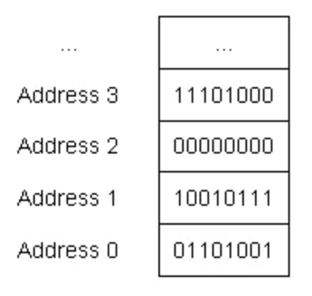
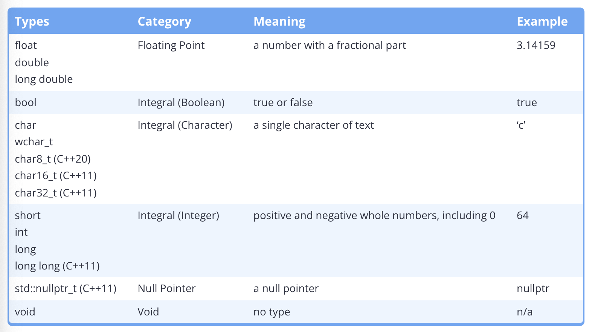
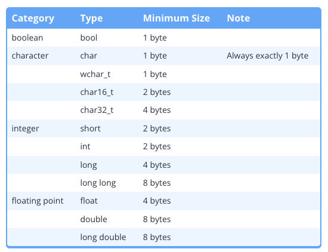
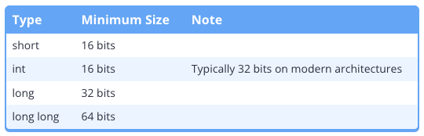
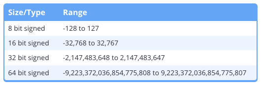
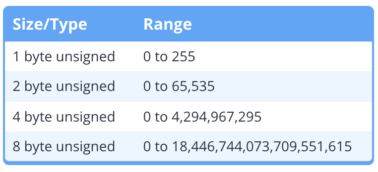

# 4.1 Introduction to fundamental data types

## Bits, bytes, and memory addressing

- Computers have _random access memory_ (RAM) that is available for programs to use. When a variable is defined, a piece of that memory is set aside for that variable.
- ***bit*** (binary digit): the smallest unit of memory used to be stored in RAM. (0 or 1)
- ***Memory address*** (or _address_): Sequential unit where memory is organized into. Similar to how a street address can be used to find a given house on a street, the memory address allows us to find and access the contents of memory at a particular location. Each memory address holds 1 byte of data. A ***byte*** is a group of bits that are operated on as a unit. A byte = 8 bits
- Key insight: In C++, we typically work with "byte-sized" chunks of data.
  

### Data types

When given an object a value, the compiler and CPU take care of encoding your value into the appropriate sequence of bits for the data type declared (i.e. integer), which are then stored in memory as bits. For example, if you assign an integer object the value 65, that value is converted to the sequence of bits ***0100 0001*** and stored in the memory assigned to the object. Reverse of converting back to the value from sequence of bits is also possible by the compiler and CPU.

## Fundamental data types



[Note]

`string` type is not a fundamental type in C++. They are a compound type. (std::string)

# 4.2 Void

# 4.3 Object sizes and the sizeof operator

## Object sizes

Most objects actually take up more than 1 byte of memory. A single object may use 2, 4, 8 or even more consecutive memory addresses. The amount of memory that an object uses is based on its data type.

When accessing some variable x, details of how many bytes an object uses are hidden and only the compiler knows.

There are several reasons it is useful to know how much memory an object uses.

1. The more memory an object uses, the more information it can hold. An object with n bits can hold 2^n unique values. For instance, an 8-bit byte can hold 2^8 (256) different values. An object that uses 2 bytes can hold 2^16 different values (1byte = 8 bits, 2 byte = 16 bits).
2. Computers have a finite amount of free memory. Every time we define an object, a small portion of that free memory is used for as long as the object is in existence. Because modern computers have a lot of memory, this impact is usually negligible. However, for programs that need a large amount of objects or data (e.g. a game that is rendering millions of polygons), the difference between using 1 byte and 8 byte objects can be significant.

## Fundamental data type sizes



Best Practice: For maximum compatibility, you shouldn't assume that variables are larger than the specified minimum size.

## The sizeof operator

```
#include <iostream>

int main()
{
    std::cout << "bool:\t\t" << sizeof(bool) << " bytes\n";
    std::cout << "char:\t\t" << sizeof(char) << " bytes\n";
    std::cout << "wchar_t:\t" << sizeof(wchar_t) << " bytes\n";
    std::cout << "char16_t:\t" << sizeof(char16_t) << " bytes\n";
    std::cout << "char32_t:\t" << sizeof(char32_t) << " bytes\n";
    std::cout << "short:\t\t" << sizeof(short) << " bytes\n";
    std::cout << "int:\t\t" << sizeof(int) << " bytes\n";
    std::cout << "long:\t\t" << sizeof(long) << " bytes\n";
    std::cout << "long long:\t" << sizeof(long long) << " bytes\n";
    std::cout << "float:\t\t" << sizeof(float) << " bytes\n";
    std::cout << "double:\t\t" << sizeof(double) << " bytes\n";
    std::cout << "long double:\t" << sizeof(long double) << " bytes\n";

    return 0;
}
```

# 4.4 Signed Integers



## Signed integers

- Attribute of being positive, negative, or zero is called the number's ***sign***
- By default, integers are ***signed***, which means the number's sign is stored as part of the number (using a single bit called the ***sign bit***). Therefore, a signed integer can hold both positive and negative numbers (and 0)

## Defining signed integers

preferred way (Best Practice)

```apache
short s;
int i;
long l;
long long ll;
```

Possible optional `signed` keyword (not preferred)

```apache
signed short ss;
signed int si;
signed long sl;
signed long long sll;
```

## Signed integer ranges

Explaining using an example, an 8-bit integer contains 8 bits. 2^8 is 256, so an 8-bit integer can hold 256 possible values. There are 256 possible values between -128 to 127, inclusive. (positive +1 than negative range due to "0" included in positive range)



## Integer overflow

***Integer overflow*** occurs when we try to store a value that is outside the range of the type. Essentially, the number we are trying to store requires more  bits to represent than the object has available. In such a case, data is lost because the object doesn't have enough memory to store everything.

NOTE: Signed integer overflow will result in undefined behavior.

Warning: integer division will lose any fractional part of the quotient.

# 4.5 Unsigned integers, and why to avoid them

## Unsigned integer range

A 1-byte unsigned integer has a range of 0 to 255. Compare this to the 1-byte signed integer range of -128 to 127. Both can store 256 different values, but signed integers use half of their range for negative numbers, whereas unsigned integers can store positive numbers that are twice as large.



When no negative numbers are required, unsigned integers are well-suited for networking and systems with little memory, because unsigned integers can store more positive numbers without taking up extra memory.

## Remembering the terms signed and unsigned

## Unsigned integer overflow

"wraps around" occurs.

255 is a range of a 1-byte integer. For 256, it wraps around to the value 0. 257 wraps around to the value 1.

[Wrap around example]

```apache
#include <iostream>

int main()
{
    unsigned short x{ 65535 }; // largest 16-bit unsigned value possible
    std::cout << "x was: " << x << '\n';

    x = 65536; // 65536 is out of our range, so we get wrap-around
    std::cout << "x is now: " << x << '\n';

    x = 65537; // 65537 is out of our range, so we get wrap-around
    std::cout << "x is now: " << x << '\n';

    return 0;
}


x was: 65535
x is now: 0
x is now: 1

```

[Wrap around the other direction]

```apache
#include <iostream>

int main()
{
    unsigned short x{ 0 }; // smallest 2-byte unsigned value possible
    std::cout << "x was: " << x << '\n';

    x = -1; // -1 is out of our range, so we get wrap-around
    std::cout << "x is now: " << x << '\n';

    x = -2; // -2 is out of our range, so we get wrap-around
    std::cout << "x is now: " << x << '\n';

    return 0;
}


x was: 0
x is now: 65535
x is now: 65534
```

## The controversy over unsigned numbers

Many developers believe that developers should generally avoid unsigned integers. Two reasons:

First, consider the subtraction of two unsigned numbers, such as 3 and 5. 3 minus 5 is -2, but -2 can’t be represented as an unsigned number.

```apache
#include <iostream>

int main()
{
	unsigned int x{ 3 };
	unsigned int y{ 5 };

	std::cout << x - y << '\n';
	return 0;
}

// 4294967294
```

Second, unexpected behavior can result when you mix signed and unsigned integers. In a mathematical operation in C++ (e.g. arithmetic or comparison), if one signed and one unsigned integer are used, the signed integer will be converted to unsigned. And because unsigned integers can not store negative numbers, this can result in loss of data.

```apache
#include <iostream>

int main()
{
    signed int s { -1 };
    unsigned int u { 1 };

    if (s < u) // -1 is implicitly converted to 4294967295, and 4294967295 < 1 is false
        std::cout << "-1 is less than 1\n";
    else
        std::cout << "1 is less than -1\n"; // this statement executes

    return 0;
}


// 
```


Best practice: Favor signed numbers over unsigned numbers for holding quantities (even quantities that should be non-negative) and mathematical operations. Avoid mixing signed and unsigned numbers.


## When to use unsigned numbers


First, unsigned numbers are preferred when dealing with bit manipulation (covered in chapter O (That’s a capital ‘o’, not a ‘0’). They are also useful when well-defined wrap-around behavior is required (useful in some algorithms like encryption and random number generation).

Second, use of unsigned numbers is still unavoidable in some cases, mainly those having to do with array indexing. We’ll talk more about this in the lessons on arrays and array indexing. In these cases, the unsigned value can be converted to a signed value.


## 4.6 Fixed-width integers and size_t
